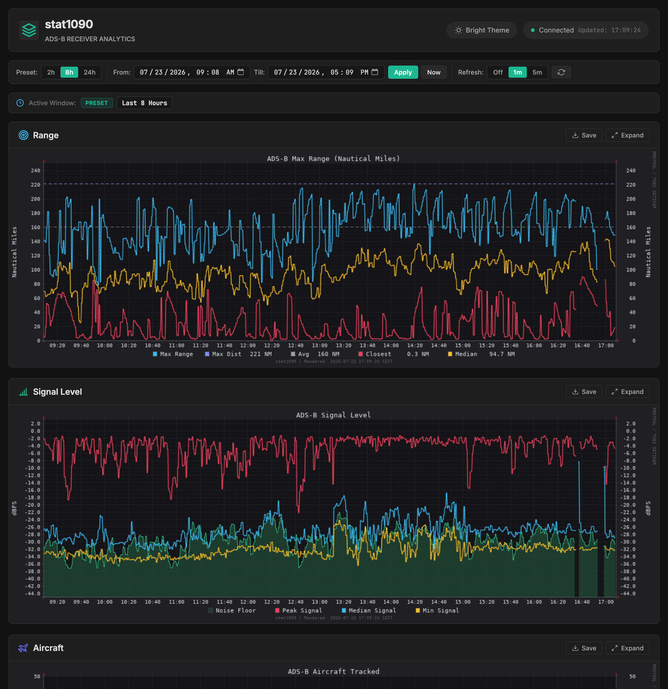
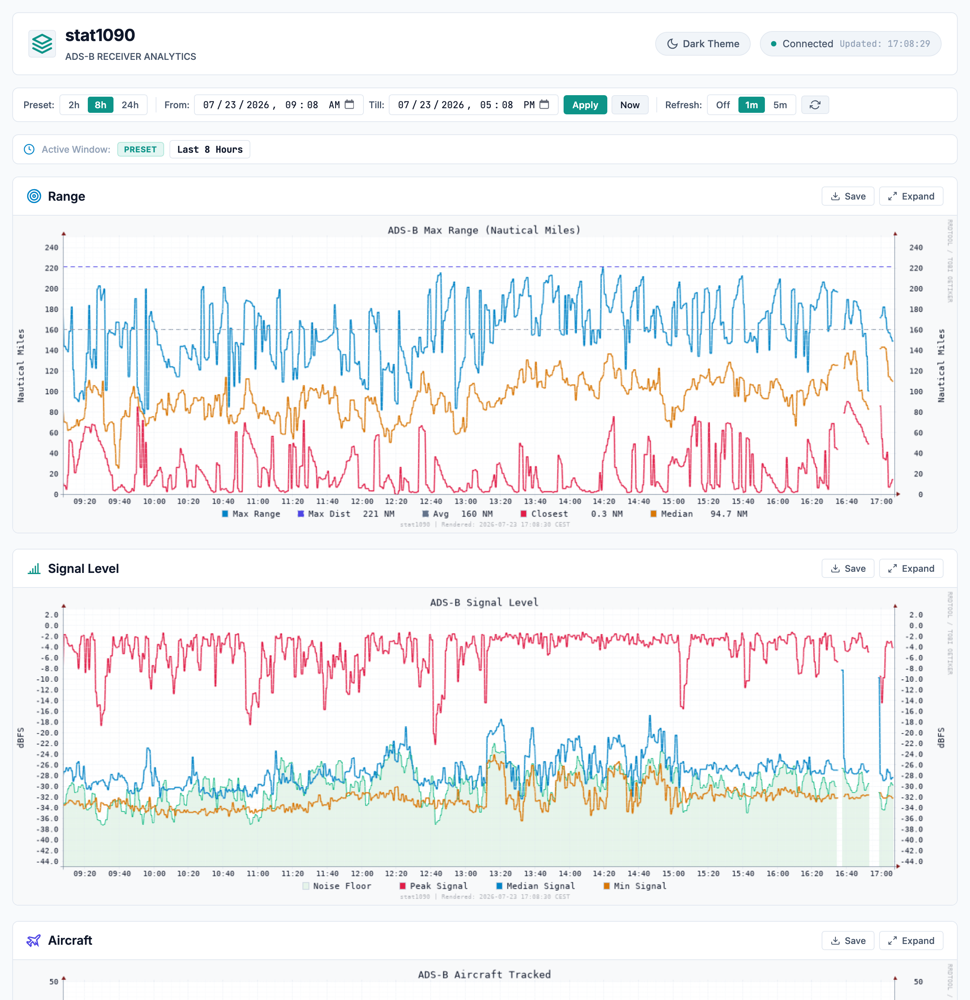

# stat1090

**stat1090** is a streamlined, high-performance statistics and visualization web application for dump1090 / ADS-B receivers, inspired by `graphs1090`.

Unlike standard full-suite graph toolkits, `stat1090` focuses specifically on core receiver metrics with custom execution time window filtering (**`from`** and **`till`** values) and multithreaded dynamic graph rendering.

---

## Previews

| Dark Theme | Bright Theme |
|:---:|:---:|
|  |  |

---

## Key Features

1. **Exact Time Range Filtering (`from` & `till`)**:
   - Interactively select exact **`from`** (Start Time) and **`till`** (End Time) date-time bounds via date-time pickers or API parameters.
   - 24-hour military time formatting (`HH:mm` / `HH:mm:ss`) across inputs and dashboard badges.
   - Live URL synchronization (`?from=2026-07-22T08:00&till=2026-07-22T14:00`) for easy bookmarking and link sharing.
   - Quick preset timeframe buttons (`2h` default, `8h`, `24h`, `48h`, `7d`, `14d`, `30d`, `90d`, `180d`, `365d`).

2. **Tailored Graph Set & Unified High-Contrast Palette**:
   - **ADS-B Range**: Maximum range (Nautical Miles/Statute Miles/km), max peak distance line, average max range, median distance, and closest distance.
   - **ADS-B Signal Level**: Peak signal level, median signal level, minimum signal (dBFS), `-3 dBFS` horizontal reference line, and noise floor area fill.
   - **ADS-B Aircraft Tracked**: Total aircraft tracked with crisp boundary line plot and ADS-B position breakdown.

3. **Multithreaded Web Architecture & Glassmorphism Design**:
   - Built-in multithreaded Python web server (`ThreadingMixIn` + `HTTPServer`) serving concurrent requests without blocking.
   - Sleek glassmorphism web UI with dark/light themes, loading spinners, instant saving, and modal lightbox zoom.
   - Reverse proxy configuration snippets included for Lighttpd and Nginx.

---

## Project Structure

```
stat1090/
├── html/
│   ├── index.html       # Web UI dashboard
│   ├── stat.css         # Glassmorphic styling & theme tokens
│   └── stat.js          # Range & auto-refresh controller
├── cgi-bin/
│   └── stat1090.cgi     # CGI fallback script for on-demand graph generation
├── screenshots/
│   ├── dark.png         # Dark theme preview
│   └── bright.png       # Light theme preview
├── stat1090.sh          # Core rrdtool graph rendering engine
├── stat1090-server.py   # Multithreaded Python web server & API renderer
├── backup-collectd.sh   # Collectd statistics backup & rotation script
├── service-stat1090.sh  # Systemd service launcher wrapper
├── stat1090.service     # Systemd unit file
├── 88-stat1090.conf     # Lighttpd config snippet
├── nginx-stat1090.conf  # Nginx config snippet
├── AGENTS.md            # Agentic architecture & documentation
├── install.sh           # Automated installation script
├── uninstall.sh         # Cleanup uninstaller
└── README.md            # Project documentation
```

---

## Installation

Run the automated installer:

```bash
sudo ./install.sh
```

Once installed, access the web dashboard at:
`http://<your-pi-ip>:8080/` or `http://<your-pi-ip>/stat1090/` (if using Lighttpd/Nginx).

---

## API Usage for Dynamic Graphs

You can query graphs directly by passing `type`, `from`, and `till` parameters:

```
GET /api/graph?type={range|signal|aircraft|messages|tracks}&from={start}&till={end}&theme={dark|light}
```

### Examples:

- **Custom Datetime Range**:
  ```
  http://localhost:8080/api/graph?type=range&from=2026-07-22T08:00&till=2026-07-22T14:00
  ```

- **Unix Timestamp Range**:
  ```
  http://localhost:8080/api/graph?type=signal&from=1784716800&till=1784738400
  ```

- **Relative Preset Range**:
  ```
  http://localhost:8080/api/graph?type=aircraft&from=48h&till=now
  ```

---

## Collectd Disk Flushing & Backup Setup

Collectd saves statistics to memory (`tmpfs` at `/run/collectd`) to minimize SD card wear.

### 1. Collectd Disk Flushing Cron (`/etc/cron.d/collectd_to_disk`)

When `graphs1090` is installed on your receiver, `/etc/cron.d/collectd_to_disk` is already pre-configured:

```cron
# restart collectd so data is saved to disk
52 23 * * * root /bin/systemctl restart collectd
```

If configuring on a standalone receiver without `graphs1090`, create `/etc/cron.d/collectd_to_disk` with the entry above to flush statistics to `/var/lib/collectd` daily before backups run.

### 2. Backup Script (`backup-collectd.sh`)

The included `backup-collectd.sh` script archives `/var/lib/collectd`, uploads the tarball to Google Drive via `rclone copy` (`gdrive:ADSB`), and rotates backups to keep only the 7 newest archives:

```bash
# Run backup manually
sudo /usr/share/stat1090/backup-collectd.sh
```

---

## License

MIT License.
