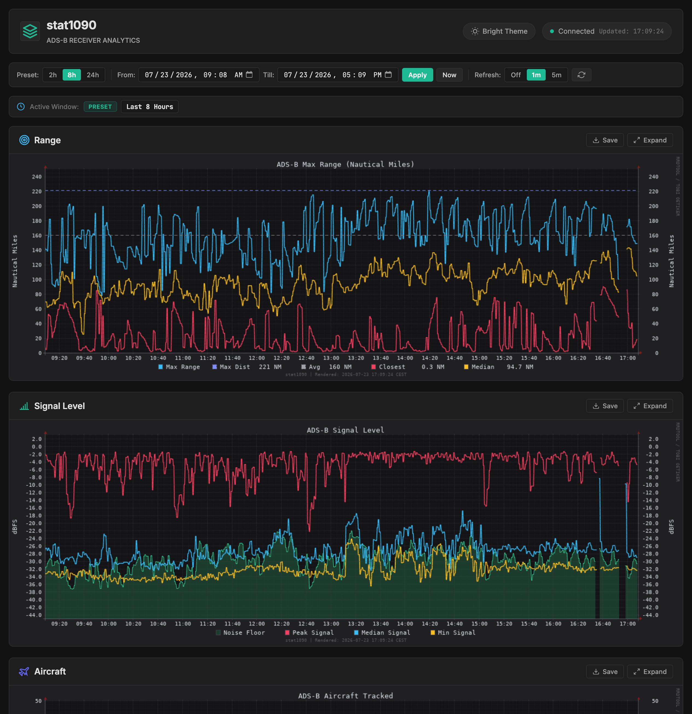
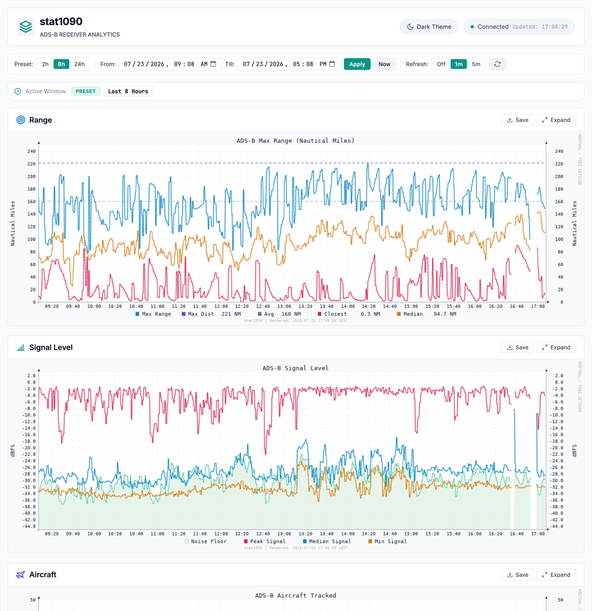

# stat1090

**stat1090** is a streamlined, high-performance statistics and visualization web application for dump1090 / readsb ADS-B receivers.

It delivers real-time receiver analytics, GNSS-resilient airport traffic monitoring (landings & departures), and system thermal monitoring with exact time window filtering (**`from`** and **`till`**) and dynamic multithreaded graph rendering.

---

## Previews

| Dark Theme | Bright Theme |
|:---:|:---:|
|  |  |

---

## Key Features

1. **Exact Time Range Filtering (`from` & `till`)**:
   - Interactively select exact **`from`** (Start Time) and **`till`** (End Time) date-time bounds via date-time pickers or API parameters.
   - 24-hour military time formatting (`HH:mm` / `HH:mm:ss`) across inputs and dashboard badges.
   - Live URL synchronization (`?from=2026-07-22T08:00&till=2026-07-22T14:00`) for easy bookmarking and link sharing.
   - Quick preset timeframe buttons (`2h` default, `8h`, `24h`, `48h`, `7d`, `14d`, `30d`, `90d`, `180d`, `365d`).

2. **Core Receiver Analytics & Airport Traffic Spotter**:
   - **ADS-B Signal Level**: Peak signal level, median signal, minimum signal (dBFS), `-3 dBFS` reference line, and noise floor area fill.
   - **ADS-B Range**: Maximum range (Nautical Miles/Statute Miles/km), max peak distance line, average max range, median distance, and closest distance.
   - **ADS-B Aircraft Tracked**: Total aircraft tracked with crisp mint green boundary line plot and ADS-B position breakdown.
   - **Landings & Departures (Hourly)**: Cumulative sawtooth flight counter resetting at the top of every hour. GNSS-resilient algorithm using altitude, ground speed, and vertical rate thresholds.
   - **System Temperature**: System CPU/GPU thermal zone temperatures in °C with symmetrical left and right Y-axes.
   - **Memory Utilization**: Stacked memory usage chart (`Used`, `Buffers`, `Cache`, `Free`) calculated via `htop` methodology.

3. **Standalone Architecture & Glassmorphism Design**:
   - Flat application design with a single Python collector (`stat1090.py`) and custom TypesDB (`stat1090.db`).
   - Configurable via `/etc/default/stat1090.conf` (spotter speed, altitude, commercial callsigns, categories).
   - Built-in multithreaded Python web server (`ThreadingMixIn` + `HTTPServer`) serving concurrent requests without blocking.
   - Sleek glassmorphism web UI with dark/light themes, loading spinners, instant image saving, and modal lightbox zoom.
   - Reverse proxy configuration snippets included for Lighttpd and Nginx.

---

## Project Structure

```
stat1090/
├── html/
│   ├── index.html       # Web UI dashboard (5 graph cards)
│   ├── stat.css         # Glassmorphic styling & theme tokens
│   └── stat.js          # Range & auto-refresh controller
├── scripts/
│   ├── readback.sh      # RAM restore script
│   ├── writeback.sh     # RAM archive script
│   └── malarky.conf     # systemd collectd drop-in template
├── cgi-bin/
│   └── stat1090.cgi     # CGI fallback script for on-demand graph generation
├── screenshots/
│   ├── dark.png         # Dark theme preview
│   └── bright.png       # Light theme preview
├── stat1090.py          # Unified Python collectd plugin
├── stat1090.db          # Custom TypesDB definition file
├── stat1090.conf        # Traffic spotter configuration file
├── collectd-stat1090.conf # Standalone collectd configuration template
├── stat1090.sh          # Core rrdtool graph rendering engine
├── stat1090-server.py   # Multithreaded Python web server & API renderer
├── backup-collectd.sh   # Collectd statistics backup & rotation script
├── service-stat1090.sh  # Systemd service launcher wrapper
├── stat1090.service     # Systemd unit file
├── 88-stat1090.conf     # Lighttpd config snippet
├── nginx-stat1090.conf  # Nginx config snippet
├── AGENTS.md            # Architecture & documentation
├── install.sh           # Automated standalone installer
├── uninstall.sh         # Cleanup uninstaller
└── README.md            # Project documentation
```

---

## Installation

Run the automated standalone installer:

```bash
sudo ./install.sh
```

Once installed, access the web dashboard at:
`http://<your-pi-ip>:8080/` or `http://<your-pi-ip>/stat1090/` (if using Lighttpd/Nginx).

---

## Configuration (`/etc/default/stat1090.conf`)

Customize the airport traffic spotter settings in `/etc/default/stat1090.conf`:

```ini
[traffic]
min_speed = 125
max_speed = 250
min_rate = 200
max_alt = 4500
filter_commercial_prefixes = false
commercial_prefixes = RYR,WZZ,LOT,DLH,KLM,SAS,ENT,EWG,TVP,SDM,AFR,BAW,FIN,AEE,LGL,AUA,SWR,TAP,IBE,WUK,TRA,PBD
allowed_categories = A2,A3,A4,A5
```

---

## API Usage for Dynamic Graphs

You can query graphs directly by passing `type`, `from`, and `till` parameters:

```
GET /api/graph?type={signal|range|aircraft|traffic|temperature}&from={start}&till={end}&theme={dark|light}
```

### Examples:

- **Landings & Departures**:
  ```
  http://localhost:8080/api/graph?type=traffic&from=24h&till=now
  ```

- **System Temperature**:
  ```
  http://localhost:8080/api/graph?type=temperature&from=24h&till=now
  ```

- **Custom Datetime Range**:
  ```
  http://localhost:8080/api/graph?type=range&from=2026-07-22T08:00&till=2026-07-22T14:00
  ```

- **Unix Timestamp Range**:
  ```
  http://localhost:8080/api/graph?type=signal&from=1784716800&till=1784738400
  ```

---

## Collectd RAM-to-Disk Flushing & Backup Setup

`stat1090` runs statistics in RAM (`tmpfs` at `/run/collectd`) to eliminate SD card wear.

### 1. Daily RAM-to-Disk Flush (`/etc/cron.d/stat1090`)

The installer configures `/etc/cron.d/stat1090` to automatically flush statistics from RAM to disk (`/var/lib/collectd/rrd/localhost.tar.gz`) daily at 23:42:

```cron
42 23 * * * root /bin/systemctl restart collectd
```

### 2. Cloud Backup Script (`backup-collectd.sh`)

The included `backup-collectd.sh` script archives `/var/lib/collectd`, uploads the compressed tarball to Google Drive via `rclone copy` (`gdrive:ADSB`), and retains the 7 newest backups:

```bash
# Run backup manually
sudo /usr/share/stat1090/backup-collectd.sh
```

---

## Documentation

- **[Agent Architecture Specification (`AGENTS.md`)](file:///home/yk/proj/stat1090/AGENTS.md)**: Deep technical architecture, graph formulas, and data flows.
- **[RWY 29 Airport Spotter Plan (`docs/RWY29_SPOTTER_PLAN.md`)](file:///home/yk/proj/stat1090/docs/RWY29_SPOTTER_PLAN.md)**: Details on the coordinate-free GNSS-jamming resilient tracking algorithm.

---

## License

MIT License.
